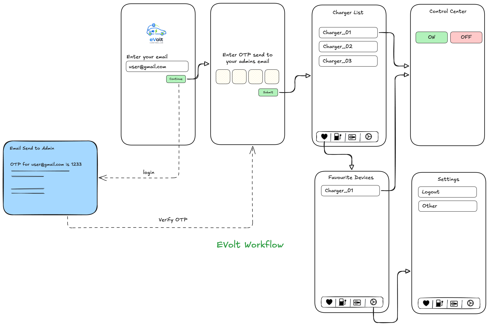

# Evolte - EV Charger Controller

A comprehensive EV Charger control system consisting of a Flutter mobile application and ESP32 firmware for Bluetooth Low Energy (BLE) communication and device control.



## 📱 Mobile Application

The mobile app is built with Flutter and provides a user-friendly interface for: 

- **Bluetooth Device Scanning**: Discover and connect to ESP32 devices
- **Device Control**: Send commands to control connected devices
- **Real-time Communication**: Bidirectional BLE communication with ESP32

## Mobile App Tech Stack

- **Framework**: Flutter
- **State Management**: GetX
- **Bluetooth**: flutter_blue_plus
- **UI Components**: flex_color_scheme, iconsax_flutter
- **Utilities**: flutter_screenutil, gap, fluttertoast

## ESP32 Firmware Tech Stack

- **Framework**: ESP-IDF
- **Bluetooth**: NimBLE stack
- **Language**: C
- **RTOS**: FreeRTOS

## 🚀 Getting Started

### Prerequisites

- Flutter SDK (^3.8.0)
- ESP-IDF development environment
- Android Studio / VS Code
- ESP32 development board

### Mobile App Setup

1. **Clone the repository**

   ```bash
   git clone <repository-url>
   cd evolte_controller/app_code
   ```

2. **Install dependencies**

   ```bash
   flutter pub get
   ```

3. **Run the app**
   ```bash
   flutter run
   ```

### ESP32 Firmware Setup

1. **Navigate to ESP32 code directory**

   ```bash
   cd evolte_esp_code
   ```

2. **Configure the project**

   ```bash
   idf.py menuconfig
   ```

3. **Build and flash**
   ```bash
   idf.py build
   idf.py -p [PORT] flash monitor
   ```

## 📁 Project Structure

```
evolt_controller/
├── app_code/                 # Flutter mobile application
│   ├── lib/
│   │   ├── app/
│   │   │   ├── controls/     # Device control screens
│   │   │   └── scan/         # BLE scanning and connection
│   │   ├── consts/           # Constants and configurations
│   │   └── widgets/          # Reusable UI components
│   ├── android/              # Android-specific configurations
│   ├── ios/                  # iOS-specific configurations
│   └── pubspec.yaml          # Flutter dependencies
├── evolte_esp_code/          # ESP32 firmware
│   ├── main/
│   │   ├── main.c           # Main firmware code
│   │   └── gatts_demo.c     # BLE GATT service implementation
│   └── CMakeLists.txt       # Build configuration
└── assets/
    └── workflow.png         # System architecture diagram
```

## 🔌 Hardware Requirements

- **ESP32 Development Board**: Any ESP32 variant (ESP32, ESP32-C3, ESP32-S2, ESP32-S3)
- **Relay Module**: For controlling high-power devices
- **Power Supply**: Appropriate power supply for your devices

## 📱 Usage

1. **Power on the ESP32** - The device will start advertising as a BLE server
2. **Open the mobile app** - Launch the Evolte Controller app
3. **Scan for devices** - The app will automatically scan for available BLE devices
4. **Connect to device** - Select your ESP32 device from the list
5. **Send commands** - Use the control interface to send commands to your devices

## 📄 License

This project is licensed under the MIT License - see the [LICENSE](LICENSE) file for details.

## 🆘 Support

If you encounter any issues or have questions:

- Check the [Issues](../../issues) page
- Review the ESP-IDF documentation
- Consult Flutter documentation for app-related questions

---

**Note**: This project is designed for educational and development purposes. Ensure proper safety measures when controlling electrical devices.
